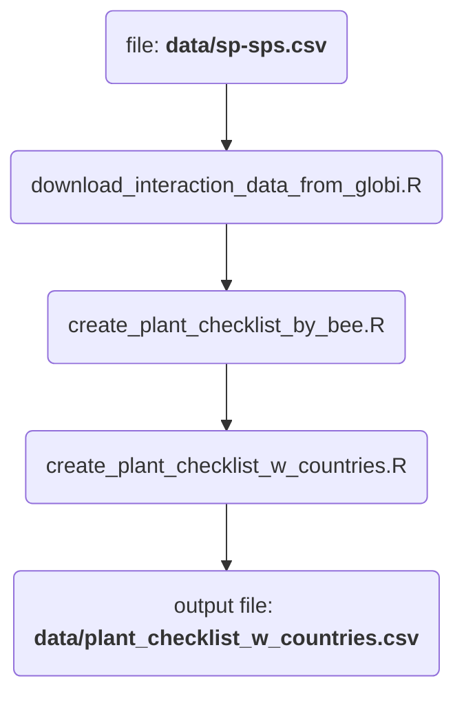

# BeeTool Data Processing Scripts Repository

This repository aims to store scripts used for information processing.

## Objective

The primary purpose of this repository is to provide a centralized location for 
storing and managing scripts used in data and information processing. These 
scripts can address a variety of tasks, such as data analysis, format 
transformation, data cleaning, report generation, among others.

## Usage

You can explore the scripts available in this repository to find those relevant 
to your information processing needs. If you wish to use any of the scripts, 
make sure to review the documentation and comments within the script to 
understand its functionality and requirements.

## Data flow description and script dependency

Bee species and their `sp_codes` are listed in the `data/sp-sps.csv` file. The 
objective is to create a plant checklist, which can be reviewed by a plant 
taxonomy specialist. To achieve this, follow the script execution steps outlined 
below.

## Contact

If you have questions or need further information about this repository, you 
can contact Juan M Barrios <juan.barrios@conabio.gob.mx>.
